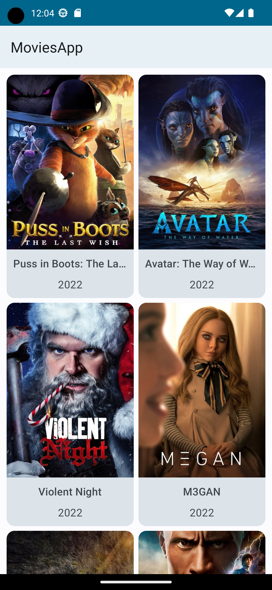
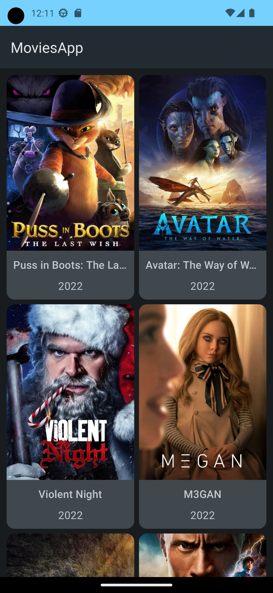
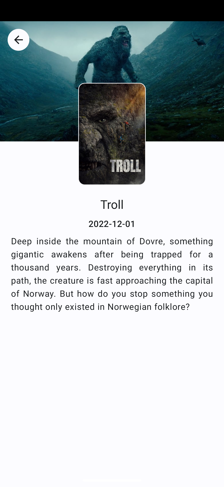
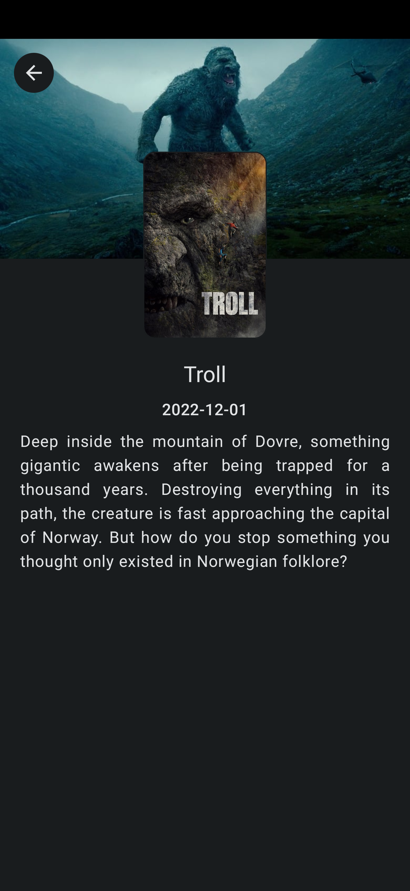

<h1 align="center">MovieApp</h1>
<h4 align="center">Simple movie listing app written with Jetpack Compose using TheMovieDb API</h1>

 

## Screenshots

## Setup

Find a file called `local.propertis`.
- Add `TMDB_API_KEY = "YOUR-API-KEY"`

## Technologies

- [Kotlin](https://kotlinlang.org/) %100 Kotlin.
- [Jetpack Compose](https://developer.android.com/jetpack/compose)
- [Material 3](https://m3.material.io/)
- [Compose Paging 3](https://developer.android.com/jetpack/androidx/releases/paging)
- [Coil](https://github.com/coil-kt/coil)
- [Coroutines](https://github.com/Kotlin/kotlinx.coroutines)
- [ViewModel](https://developer.android.com/topic/libraries/architecture/viewmodel)
- [Dagger Hilt](https://developer.android.com/training/dependency-injection/hilt-android) for Dependency Injection
- [OkHttp](https://github.com/square/okhttp), and [Retrofit](https://github.com/square/retrofit) for network operations
- [TheMovieDb(Tmdb) API](https://developers.themoviedb.org/3)
